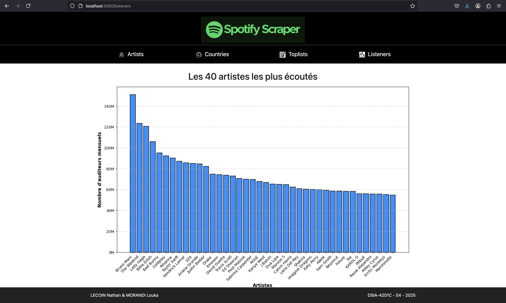

# Scraper Spotify 


Cette application de web scraping permet d'extraire des données détaillées à partir de Spotify, offrant une vue approfondie des statistiques des artistes, de leurs streams et des tendances musicales par pays. Les données sont récupérées depuis kworb.net, une plateforme qui compile les informations publiques relatives aux performances des artistes et des morceaux sur Spotify.

L'application permet de suivre l'évolution des artistes populaires, d'analyser les performances des morceaux à travers le monde et de découvrir les genres musicaux dominants dans différents pays. 

## Objectif 

L'objectif principal de ce projet est de créer une application de web scraping pour extraire, analyser et visualiser des données musicales provenant de Spotify via kworb.net.


## Table des Matières

- [User Guide](#user-guide)
- [Developer Guide](#developer-guide)
- [Techno utilisées](#Techno-utilisées)
- [Architecture du code](#Architecture-du-code)
- [Rapport d'Analyse](#rapport-d-analyse)
- [Data](#data)
- [Auteurs](#auteurs)
- [Contact](#contact)


## User Guide 

### 1. Prérequis 

Avant de démarrer ce projet, assurez-vous d'avoir installé les outils suivants :

- Git afin de cloner le projet depuis le dépôt distant GitHub.

- DockerDesktop pour déployer le projet 

### 2. Installation

Commencez par cloner ce dépôt dans votre répertoire local.

Pour ce faire, ouvrez un terminal pour stocker le projet grâce à la commande :

Lorsque vous êtes dans le dossier voulu, rentrez la commande suivante :
```bash
$ git clone https://github.com/Louka190/DataEngineerProject
```

### 3. Lancer le projet

Pour cette étape il vous suffit d'ouvrir le dossier avec Docker Desktop, puis vous rendre dans le bon dossier avec le terminal de Docker.

```bash
$ cd DataEngineerProject/
```

Une fois rendu dans le bon dossier, il ne vous reste plus qu'à taper les deux commandes suivantes pour exécuter le projet :

```bash
$ docker compose build
$ docker compose up -d
```

La première commande permet de construire le projet sur votre machine (installation des dépendances). La deuxième commande quant à elle permet de lancer le projet en allouant des conteneurs. 

Patientez ensuite jusqu'à l'apparition d'un groupe de conteneurs dans votre application Docker. Nous avons mis en place une logique d'attente entre les conteneurs pour qu'ils ne puissent pas s'exécuter tous en même temps et entrer en conflit. 


**Important** : Veillez à ne surtout pas arrêter les services c'est-à-dire les conteneurs Docker pour le bon fonctionnement de l'application Web.

Une fois le service flask en marche, vous pouvez cliquer sur le port 5050:5050 ou cliquer sur l'URL suivante : http://localhost:5050/


<br>

## Developer Guide

Ce guide vous permet de comprendre le fonctionnement du scraper, de l'API, de la base de données et du déploiement pour une prise en main rapide et efficace du projet.

### 1. Structure du Code

Le projet est organisé en plusieurs modules distincts :

- **`scraper/`** : Contient le code Scrapy pour l'extraction des données.
- **`API/`** : Fournit une interface REST avec Flask pour interagir avec les données extraites.
- **`ElasticSearch/`** : Contient le script d'intégration des données dans Elasticsearch.
- **`MongoDB/`** : Gère le stockage des données dans MongoDB.
- **`assets/`** : Contient les ressources statiques comme les images.
- **`docker-compose.yml`** : Définit les services Docker pour le projet.
- **`Pipfile`** : Liste des dépendances Python du projet.

### 2. Configuration du Scraper

Le scraper est implémenté avec **Scrapy** et utilise des spiders pour extraire les données spécifiques depuis `kworb.net`.

#### a) Définition des spiders

Les spiders se trouvent dans le dossier `scraper/spiders/` et sont définis comme suit :

- `artists.py` : Récupère les données des artistes.
- `countries.py` : Récupère les classements par pays.
- `toplists.py` : Récupère les tops globaux.
- `listeners.py` : Récupère le nombre d'auditeurs par artiste.

Chaque spider est configuré pour suivre une logique de scraping basée sur CSS Selectors.

#### b) Exécution du scraper

Le scraping peut être exécuté manuellement via la commande suivante :

```bash
$ cd scraper/
$ scrapy crawl artists -o output/artists.csv
$ scrapy crawl countries -o output/countries.csv
$ scrapy crawl toplists -o output/toplists.csv
$ scrapy crawl listeners -o output/listeners.csv
```

Les données sont stockées sous format CSV dans le dossier `output/`.

### 3. API Backend

L'API backend est construite avec Flask et expose des endpoints pour récupérer les données depuis MongoDB et Elasticsearch.

L'API est alors accessible à l'adresse : `http://localhost:5050/`


### 4. Base de Données

#### a) Stockage avec MongoDB

Les données scrappées sont stockées dans une base MongoDB via un pipeline Scrapy. La connexion se fait via le fichier `MongoDB.py`.

#### b) Indexation dans Elasticsearch

Pour analyser les données efficacement, celles-ci sont indexées dans Elasticsearch.

- Vérifiez les index via Kibana : `http://localhost:5601`

### 5. Déploiement avec Docker

L'application est entièrement conteneurisée avec Docker. Pour lancer l'environnement complet :

```bash
$ docker compose up -d
```

Cela démarre :
- MongoDB
- Elasticsearch
- Flask API
- Scraper


## Technologies utilisées

- Scrapy
- MongoDB (BDD)
- Flask (interface web, backend)
- Elasticsearch (exploration de données)
- Docker (déploiement du code)  

<br>

## Architecture du code

Vous trouverez ci-dessous un diagramme de l'architecture du code réalisé avec Mermaid :


<br>

## Rapport d'Analyse 

 L'interface web développée avec Flask et mise en valeur par Bootstrap propose plusieurs sections dédiées aux artistes, aux classements par pays, aux tops globaux et aux auditeurs uniques. 

### Homepage

La page d'accueil de notre application a été pensée pour offrir une expérience utilisateur fluide, intuitive et esthétiquement agréable. Dès son arrivée, l'utilisateur découvre une interface moderne et épurée, mettant en avant les fonctionnalités clés pour explorer et analyser les tendances musicales de Spotify. L’ensemble du design a été soigneusement élaboré et intégré, garantissant une identité visuelle harmonieuse et une immersion optimale.


<br>

### Artists 

La page Artists permet d'explorer en détail les données des 3 000 artistes les plus écoutés sur Spotify. Grâce à une barre de recherche intuitive, l'utilisateur peut facilement retrouver un artiste spécifique et accéder à ses statistiques de streaming, lui offrant ainsi une vision claire de son influence et de sa popularité sur la plateforme. Cette interface épurée et interactive facilite la navigation et l’analyse des tendances musicales.


<br>

### Countries

La page Countries offre une exploration interactive des tendances musicales à travers le monde. Grâce à un menu déroulant intuitif, l'utilisateur peut sélectionner un pays et accéder instantanément aux classements des morceaux les plus écoutés. Cette interface simplifiée permet d’analyser les préférences musicales propres à chaque région et de découvrir les artistes les plus populaires à l’échelle internationale.


<br>

### Toplists 

La page Toplists permet d’explorer les morceaux les plus streamés sur Spotify au fil des années. Grâce à un menu déroulant, l’utilisateur peut sélectionner une année spécifique et accéder instantanément au classement des titres les plus écoutés. Cette fonctionnalité offre une vue d’ensemble des tendances musicales de chaque époque, mettant en lumière l’évolution des genres et des artistes dominants sur la plateforme.


<br>

### Listeners 

La page Listeners permet d’afficher en temps réel les artistes les plus écoutés sur Spotify. Grâce à un histogramme mis à jour régulièrement, l’utilisateur peut consulter le classement des artistes en fonction de leur nombre d’auditeurs mensuels. Cette fonctionnalité offre une vision instantanée des tendances musicales actuelles, sans suivi historique des écoutes.



<br>

## Data 

Les données utilisées dans ce projet proviennent de kworb.net, un site spécialisé dans l'agrégation des performances des artistes et des morceaux sur diverses plateformes musicales, dont Spotify. Kworb.net collecte des informations détaillées sur les classements, les streams, et d'autres statistiques relatives à la popularité des morceaux à l'échelle mondiale. Ces données sont mises à jour régulièrement, offrant ainsi un aperçu précis et actualisé des tendances musicales globales.

<br>

### Auteurs

Louka MORANDI 
Nathan LECOIN

ESIEE Paris - promo E4 DSIA - 2024


### Contact

Louka MORANDI 
louka.morandi@edu.esiee.fr

Nathan LECOIN
nathan.lecoin@edu.esiee.fr


<br>

<p align="center"><a href="#top">⬆ Retour en haut</a></p>
